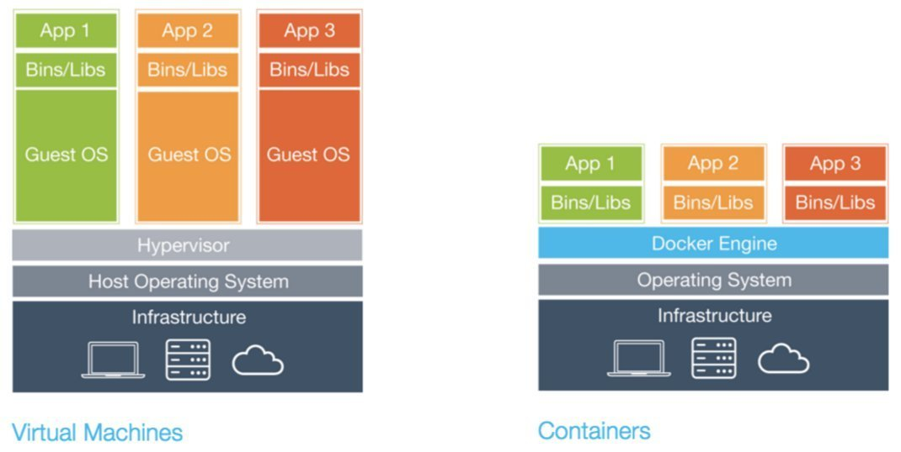
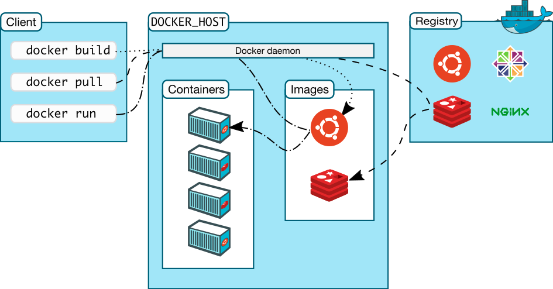

# Docker Architecture {bg=#000;assets/img/architecture.jpeg}

# Definitions

## Image:
A file, comprised of multiple layers

## Container:
A running image + volume + network, based on Linux namespaces

# Compared to VM


# Docker Architecture 
## Runtimes

- Docker Engine (_Docker Inc._)
- rkt (_RedHat_)
- CriO (_RedHat_)
- TODO

## Docker Engine

- Client-Server Application
- REST API
- Server CLI: _dockerd_
- Client CLI: _docker_
- Also manages _volume_ and _network_

# Docker engine

## Server

```render_ditaa
                  +-----------------+                                            +-----------------+
                  |                 |                                            |                 |
                  |    CONTAINER    +-----MANAGES---+           +----MANAGES-----+      IMAGE      |
                  |                 |               |           |                |                 |
                  +-----------------+               |           |                +-----------------+
                                                    |           |
                                                    |           |
                                                    |           |
                                                    |           |
                                                    |           |
                                                    |           |
                                                    |           |
                                   +----------------+-----------+-----------------+
                                   | {o}                CLIENT                    |
                                   |                  docker CLI                  |
+-----------------+                |    +------------------------------------+    |                +-----------------+
|                 |                |    | {o}          REST API              |    |                |                 |
|     NETWORK     |                |    |                                    |    |                |      VOLUME     |
|                 |                |    |    +--------------------------+    |    |                |                 |
+--------+--------+                |    |    |{o} cGRE                  |    |    |                +--------+--------+
         |                         |    |    |          SERVER          |    |    |                         |
         |                         |    |    |                          |    |    |                         |
         +--------MANAGES----------+    |    |       docker daemon      |    |    +--------MANAGES----------+
                                   |    |    |                          |    |    |
                                   |    |    |                          |    |    |
                                   |    |    +--------------------------+    |    |
                                   |    +------------------------------------+    |
                                   +----------------------------------------------+

```


## Rest API

```render_ditaa
                  +-----------------+                                            +-----------------+
                  |                 |                                            |                 |
                  |    CONTAINER    +-----MANAGES---+           +----MANAGES-----+      IMAGE      |
                  |                 |               |           |                |                 |
                  +-----------------+               |           |                +-----------------+
                                                    |           |
                                                    |           |
                                                    |           |
                                                    |           |
                                                    |           |
                                                    |           |
                                                    |           |
                                   +----------------+-----------+-----------------+
                                   | {o}                CLIENT                    |
                                   |                  docker CLI                  |
+-----------------+                |    +------------------------------------+    |                +-----------------+
|                 |                |    | {o} cGRE     REST API              |    |                |                 |
|     NETWORK     |                |    |                                    |    |                |      VOLUME     |
|                 |                |    |    +--------------------------+    |    |                |                 |
+--------+--------+                |    |    |{o} cCCC                  |    |    |                +--------+--------+
         |                         |    |    |          SERVER          |    |    |                         |
         |                         |    |    |                          |    |    |                         |
         +--------MANAGES----------+    |    |       docker daemon      |    |    +--------MANAGES----------+
                                   |    |    |                          |    |    |
                                   |    |    |                          |    |    |
                                   |    |    +--------------------------+    |    |
                                   |    +------------------------------------+    |
                                   +----------------------------------------------+

```

## Client

```render_ditaa
                  +-----------------+                                            +-----------------+
                  |                 |                                            |                 |
                  |    CONTAINER    +-----MANAGES---+           +----MANAGES-----+      IMAGE      |
                  |                 |               |           |                |                 |
                  +-----------------+               |           |                +-----------------+
                                                    |           |
                                                    |           |
                                                    |           |
                                                    |           |
                                                    |           |
                                                    |           |
                                                    |           |
                                   +----------------+-----------+-----------------+
                                   | {o} cGRE           CLIENT                    |
                                   |                  docker CLI                  |
+-----------------+                |    +------------------------------------+    |                +-----------------+
|                 |                |    | {o} cCCC     REST API              |    |                |                 |
|     NETWORK     |                |    |                                    |    |                |      VOLUME     |
|                 |                |    |    +--------------------------+    |    |                |                 |
+--------+--------+                |    |    |{o} cCCC                  |    |    |                +--------+--------+
         |                         |    |    |          SERVER          |    |    |                         |
         |                         |    |    |                          |    |    |                         |
         +--------MANAGES----------+    |    |       docker daemon      |    |    +--------MANAGES----------+
                                   |    |    |                          |    |    |
                                   |    |    |                          |    |    |
                                   |    |    +--------------------------+    |    |
                                   |    +------------------------------------+    |
                                   +----------------------------------------------+

```


# Docker Registry

- Server application
- Store and distribute images
- With REST API
- Examples: 
  - Docker Hub
  - Quay
  - Registry

# How it fits together




